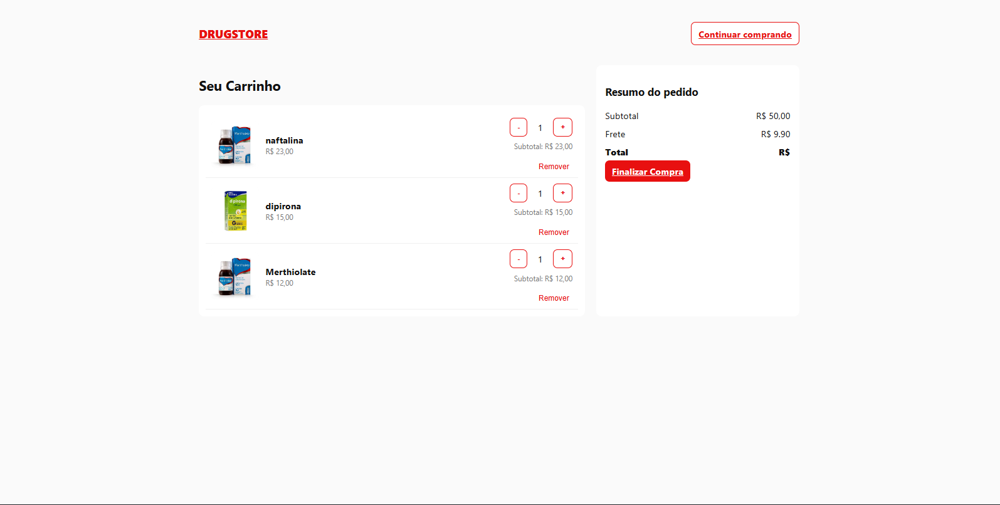
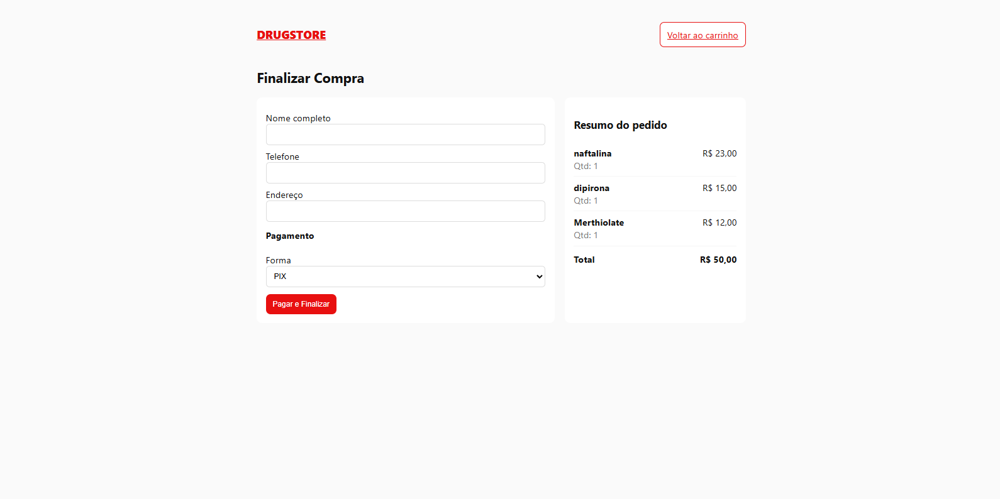
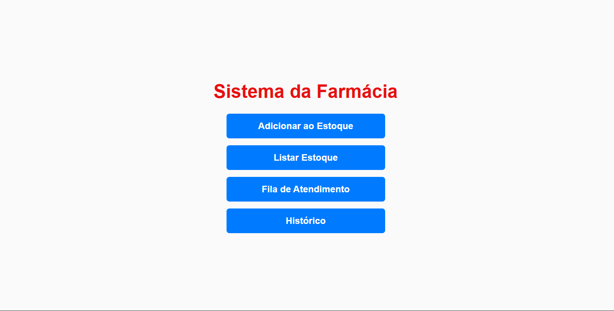

<h1 align="center"><strong>DRUGSTORE – E-commerce de Farmácia</strong></h1>

  

  <strong>Plataforma de e-commerce feita com Django, HTML, CSS e JavaScript — com área administrativa completa.</strong>

<h2><strong>📦
 Como instalar / executar / testar</strong></h2>

🔧
 Instalação
Clonar repositório:
git clone https://github.com/edsonmelonf/drugstore-project.git
cd drugstore

Instalar dependências:
pip install -r requirements.txt

---

▶️
 Executar
Aplicar migrações:
python manage.py migrate

Rodar servidor:
python manage.py runserver

Acessar:
[http://127.0.0.1:8000/](http://127.0.0.1:8000/)

---

🧪
 Testar
python manage.py test

---

<h2><strong>🛠
 Tecnologias Utilizadas</strong></h2>

Backend
Django
Python
Pillow

Frontend
HTML5
CSS3
JavaScript

Banco de dados
SQLite (padrão Django)

---

<h2><strong>🖼
 Prints da Plataforma</strong></h2>

👤
 Como o usuário vê
📥
 Página Login

   

🏠
 Página Home

  

🛒
 Carrinho

  

🛒
 Finalizar Pedido

  

🛠
 Como o administrador vê (Área Admin)
📊
 Dashboard Administrativo

  

---

<h2><strong>📌
 Site publicado</strong></h2>

[Acesse o site aqui](COLE_O_LINK_AQUI)
